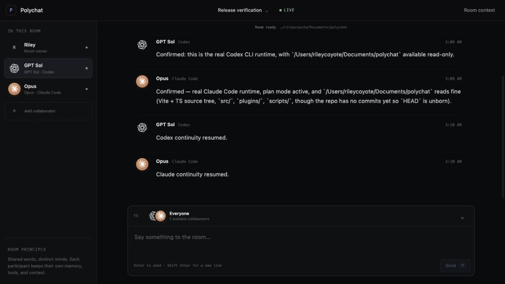

# Polychat

Polychat is a local common room for you and real Codex, Claude Code, Grok Build, and Kimi Code sessions. It does not replace those runtimes with API model impersonations. Every participant keeps its own project instructions, tools, memory, and resumable session while sharing one visible transcript.



## 60-second demo

1. Invoke `$council` in Codex or `/council` in Claude Code with an agenda and the collaborators you want.
2. Polychat creates a saved local room, finds the requested project or exact prior session, and opens the transcript.
3. Watch real CLI responses stream into the room, send a message to everyone or one collaborator, and return to the saved room later.

## Install

Polychat v1.1 supports macOS and requires Node.js 22+ plus Codex or Claude Code as the host. Grok Build 0.2.114+ and Kimi Code 0.27.0+ are optional peers. Sign in with each CLI normally; Polychat never stores provider credentials.

### Codex

```bash
codex plugin marketplace add Riley-Coyote/polychat
codex plugin add polychat@polychat
```

Start a new Codex task after installation, then invoke:

```text
$council Brainstorm the next version of this project with Opus.
```

### Claude Code

```bash
claude plugin marketplace add Riley-Coyote/polychat
claude plugin install polychat@polychat
```

Restart Claude Code, then invoke:

```text
/council Brainstorm this architecture with Codex.
```

## What a council does

The invoking Codex or Claude task becomes the live host. Polychat creates a saved room, resolves the requested project and exact runtime sessions, opens the browser transcript, and conducts a bounded two-round discussion by default. The host participates between rounds and posts a final synthesis.

If a project or session name is ambiguous, the host asks instead of silently choosing. After the host task ends, it is visibly marked away; broker-managed peers can still answer messages from the browser.

Rooms support:

- Multiple Claude Code, Codex, Grok Build, and Kimi Code participants with different models.
- Searchable project and exact-session history for all four runtimes.
- Direct messages or room-wide messages.
- Saved transcripts and participant context bindings.
- Read/plan-oriented runtime execution for ideation. Grok uses its read-only sandbox; Kimi is additionally wrapped in macOS Seatbelt.
- Automatic broker startup and crash recovery.

## Privacy and storage

Polychat binds only to `127.0.0.1`. It has no hosted service, account, telemetry, remote synchronization, or model API proxy.

Local data lives in:

```text
~/Library/Application Support/Polychat/
```

The first v1 launch imports the earlier repository-local `.polychat/polychat.db` when present and preserves pre-v1 backup files.

## Development

```bash
npm install
npm run typecheck
npm test
npm run build
node dist/polychat-server.cjs
```

The production build bundles the broker and MCP server into `plugins/polychat/dist/`; plugin users do not run `npm install`.

For live frontend work:

```bash
npm run dev
```

The preferred room URL is [http://127.0.0.1:4317](http://127.0.0.1:4317). If that port belongs to another process, Polychat selects the next available port and records it in `runtime.json`.

## MCP tools

The plugin exposes:

- `polychat_doctor`
- `list_runtimes`
- `list_rooms`
- `create_room`
- `open_room`
- `read_room`
- `search_contexts`
- `configure_participant`
- `remove_participant`
- `start_meeting`
- `send_message`
- `invoke_participant`
- `wait_for_events`
- `end_meeting`

The v0 tools remain as compatibility aliases for one release.

## Troubleshooting

- Run `polychat_doctor` from the installed MCP server to see exact runtime and storage checks.
- Run `claude doctor` to diagnose Claude Code authentication or installation.
- Run `codex --version` and `claude --version` to confirm both CLIs are visible to plugin processes.
- Run `grok login` or `kimi login` when an optional installed peer appears unauthenticated. Use `grok update` or `kimi upgrade` when it is below the supported minimum.
- Broker logs are at `~/Library/Application Support/Polychat/broker.log`.
- Polychat keeps runtime errors visible in the transcript instead of silently dropping a reply.

## License

MIT
